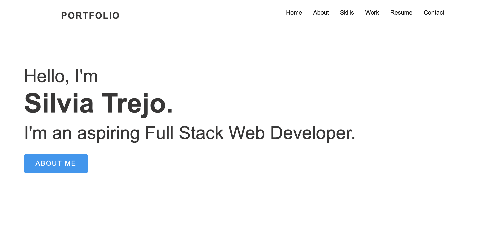
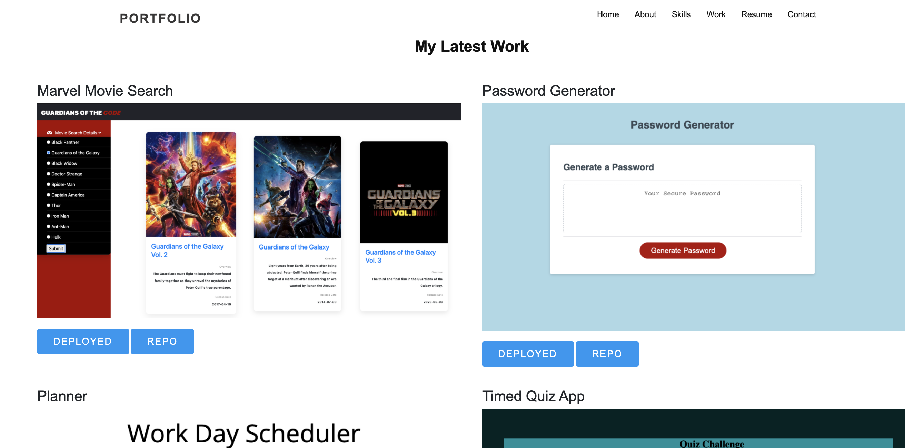
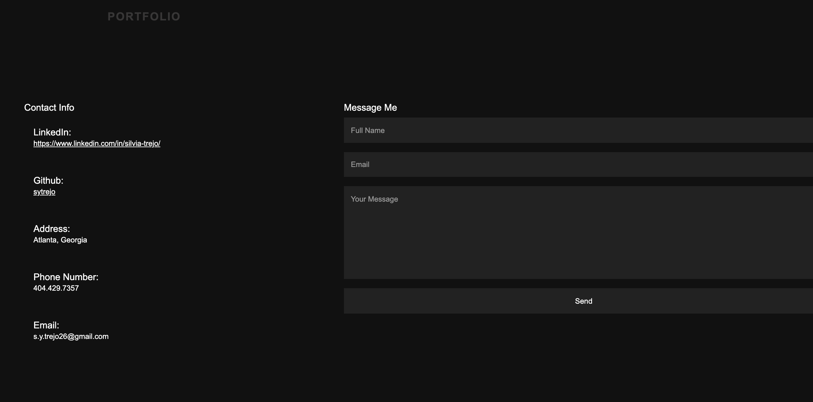

# portfolioV2

1. [Description](#Description)
2. [Usage](#Usage)
3. [Deployment](#Deployment)
4. [Screenshots](#Screenshots)

## Description

This is a work in progress application. It is my professional portfolio. It has links to my social media and to projects I have worked on. The application uses JavaScript, HTML and CSS. 

## Usage

I am using this application as a way to showcase my work. It is an easy and accessible way to document and display my work.  

## Deployment

Deployed Link: [https://sytrejo.github.io/portfolioV2/](https://sytrejo.github.io/portfolioV2/)

Repo Link: [https://github.com/sytrejo/portfolioV2](https://github.com/sytrejo/portfolioV2)

## Screenshots

